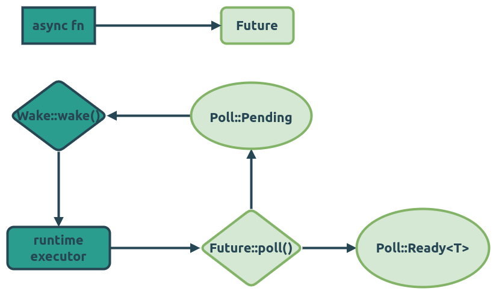

# 理解 Futures 与 Tasks

这节主要讲解 `Future` trait 以及异步任务如何被调度的.
它们分别属于 `std::future` 和 `std::task` 模块, 这两个模块分在后面两节有详细的介绍.

## `Future` trait

在同步式的代码 (synchronous code) 里调用阻塞函数(blocking function), 会阻塞整个线程;
而在异步式的代码里, `Future` 会把控制权返还给线程, 这样其它的 `Future` 就可以运行了.

它位于 `std::future`, `async fn` 会返回一个`Future` 对象, 它的接口定义如下:

```rust
pub trait Future {
    type Output;
    fn poll(self: Pin<&mut Self>, cx: &mut Context<'_>) -> Poll<Self::Output>;
}
```

通过调用 `poll()` 方法, 可以将 `Future` 对象向前推近到新的进度, 尽量接近任务完成状态.
当 `Future` 对象完成后, 它返回 `Poll::Ready(result)` 结果; 如果还没完成, 就返回 `Poll::Pending`.
然后当 `Future` 可以推进到新的进度时, 它会调用 `Wake::wake()` 函数.
当 `wake()` 被调用后, 运行时会再次调用 `Future` 的 `poll()` 方法, 这样就可以更新进度了.



这里, 如果没有 `Wake::wake()` 方法的话, 每个周期, 运行时都要依次遍历一下所有的 `Future` 对象,
看看哪个进度有所推进;
引入了 `wake()` 方法后, 运行时就可以精确地知道在数万个 `Future` 对象中有哪些的进度是有变化的,
就可以调用它们的 `poll()` 方法了.
这样的设计可以显著提高运行时的性能.

另外 `Future::poll()` 方法的第一个参数类型是 `Pin<&mut Self>`, 这个用到了内存固定 (memory pinning) 相关的,
后面章节会专门介绍它.

## `Poll` 枚举类

它位于 `std::task`, 定义如下:

```rust
pub enum Poll<T> {
    Ready(T),
    Pending,
}
```

## 使用 Waker 来通管运行时再次拉取 `Future`

`Wake` trait

`Waker` 结构体

`RawWaker` 结构体

## 使用 Context 管理运行时上下文 