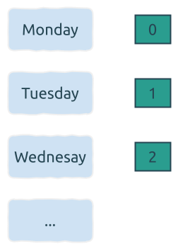

# 内存布局 Memory Layout

与其它数据类型相比, 枚举类型的内存布局比较复杂, 接下来我们分别说明.

## 只有枚举项标签

```rust
enum Weekday {
    Monday,
    Tuesday,
    Wednesday,
    Thursday,
    Friday,
    Saturday,
    Sunday,
}
```

这里, `Weekday` 类型占用1个字节的内存.



随着元素个数的增加, 可以占用2个字节或者更多.
比如下面的例子, 编译器会给它分配2个字节, 因为有太多枚举项了:

<details>
<summary><code>enum TooManyTags</code></summary>

```rust
use std::mem::size_of;

pub enum TooManyTags {
    Tag0,
    Tag1,
    Tag2,
    Tag3,
    Tag4,
    Tag5,
    Tag6,
    Tag7,
    Tag8,
    Tag9,
    Tag10,
    Tag11,
    Tag12,
    Tag13,
    Tag14,
    Tag15,
    Tag16,
    Tag17,
    Tag18,
    Tag19,
    Tag20,
    Tag21,
    Tag22,
    Tag23,
    Tag24,
    Tag25,
    Tag26,
    Tag27,
    Tag28,
    Tag29,
    Tag30,
    Tag31,
    Tag32,
    Tag33,
    Tag34,
    Tag35,
    Tag36,
    Tag37,
    Tag38,
    Tag39,
    Tag40,
    Tag41,
    Tag42,
    Tag43,
    Tag44,
    Tag45,
    Tag46,
    Tag47,
    Tag48,
    Tag49,
    Tag50,
    Tag51,
    Tag52,
    Tag53,
    Tag54,
    Tag55,
    Tag56,
    Tag57,
    Tag58,
    Tag59,
    Tag60,
    Tag61,
    Tag62,
    Tag63,
    Tag64,
    Tag65,
    Tag66,
    Tag67,
    Tag68,
    Tag69,
    Tag70,
    Tag71,
    Tag72,
    Tag73,
    Tag74,
    Tag75,
    Tag76,
    Tag77,
    Tag78,
    Tag79,
    Tag80,
    Tag81,
    Tag82,
    Tag83,
    Tag84,
    Tag85,
    Tag86,
    Tag87,
    Tag88,
    Tag89,
    Tag90,
    Tag91,
    Tag92,
    Tag93,
    Tag94,
    Tag95,
    Tag96,
    Tag97,
    Tag98,
    Tag99,
    Tag100,
    Tag101,
    Tag102,
    Tag103,
    Tag104,
    Tag105,
    Tag106,
    Tag107,
    Tag108,
    Tag109,
    Tag110,
    Tag111,
    Tag112,
    Tag113,
    Tag114,
    Tag115,
    Tag116,
    Tag117,
    Tag118,
    Tag119,
    Tag120,
    Tag121,
    Tag122,
    Tag123,
    Tag124,
    Tag125,
    Tag126,
    Tag127,
    Tag128,
    Tag129,
    Tag130,
    Tag131,
    Tag132,
    Tag133,
    Tag134,
    Tag135,
    Tag136,
    Tag137,
    Tag138,
    Tag139,
    Tag140,
    Tag141,
    Tag142,
    Tag143,
    Tag144,
    Tag145,
    Tag146,
    Tag147,
    Tag148,
    Tag149,
    Tag150,
    Tag151,
    Tag152,
    Tag153,
    Tag154,
    Tag155,
    Tag156,
    Tag157,
    Tag158,
    Tag159,
    Tag160,
    Tag161,
    Tag162,
    Tag163,
    Tag164,
    Tag165,
    Tag166,
    Tag167,
    Tag168,
    Tag169,
    Tag170,
    Tag171,
    Tag172,
    Tag173,
    Tag174,
    Tag175,
    Tag176,
    Tag177,
    Tag178,
    Tag179,
    Tag180,
    Tag181,
    Tag182,
    Tag183,
    Tag184,
    Tag185,
    Tag186,
    Tag187,
    Tag188,
    Tag189,
    Tag190,
    Tag191,
    Tag192,
    Tag193,
    Tag194,
    Tag195,
    Tag196,
    Tag197,
    Tag198,
    Tag199,
    Tag200,
    Tag201,
    Tag202,
    Tag203,
    Tag204,
    Tag205,
    Tag206,
    Tag207,
    Tag208,
    Tag209,
    Tag210,
    Tag211,
    Tag212,
    Tag213,
    Tag214,
    Tag215,
    Tag216,
    Tag217,
    Tag218,
    Tag219,
    Tag220,
    Tag221,
    Tag222,
    Tag223,
    Tag224,
    Tag225,
    Tag226,
    Tag227,
    Tag228,
    Tag229,
    Tag230,
    Tag231,
    Tag232,
    Tag233,
    Tag234,
    Tag235,
    Tag236,
    Tag237,
    Tag238,
    Tag239,
    Tag240,
    Tag241,
    Tag242,
    Tag243,
    Tag244,
    Tag245,
    Tag246,
    Tag247,
    Tag248,
    Tag249,
    Tag250,
    Tag251,
    Tag252,
    Tag253,
    Tag254,
    Tag255,
    Tag256,
    Tag257,
    Tag258,
    Tag259,
}

fn main() {
    assert_eq!(size_of::<TooManyTags>(), 2);
}
```

</details>

## 显式地指定字节数

C++ 中, 可以显式地指定其数据类型, 以便确定占用的字节数. 下面的代码片段, `Weekday` 中的枚举项就会占用4个字节:

```cpp
enum class Weekday : uint32_t {
  Monday,
  Tuesday,
  Wednesday,
  Thursday,
  Friday,
  Saturday,
  Sunday,
};
```

Rust 中可以这样写:

```rust
#[repr(u32)]
enum Weekday {
    Monday,
    Tuesday,
    Wednesday,
    Thursday,
    Friday,
    Saturday,
    Sunday,
}
```

它们这些枚举项都占用4个字节, 尽管一个字节足够存储它们的值.

