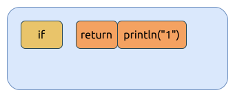

# 返回 return

`return` 表达式用于函数或者闭包 (closure)中, 从当前函数上下文退出, 返回到函数调用处.

如果函数的返回值为空, 它返回的是 `()`, 即所谓的 `unit struct`, 类似于 C 语言中的 `void`. 比如:

```rust, ignore
fn do_some() -> () {
  ...
  return;
}
```

类似于:

```C, ignore
void do_some() {
  ...
  return;
}
```

如果 `return obj;` 表达式是函数中最后一个表达式, 那么 `return` 表达式中可以简写为 `foo`, 看个例子:

```rust
fn max_num(a: i32, b: i32) -> i32 {
  if a > b {
    return a;
  } else {
    return b;
  }
}
```

通常会被简写成以下形式:

```rust
fn max_num(a: i32, b: i32) -> i32 {
  if a > b {
    a
  } else {
    b
  }
}
```

##   

```rust
{{#include assets/return-if.rs:5: }}
```

```rust, ignore
{{#include assets/return-if.mir:3: }}
```

