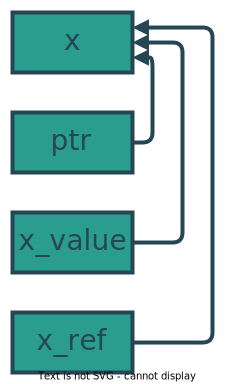

# NonNUll

`NonNull<T>` 实现类似可变指针 `*mut T` 的功能, 同时有以下区别:
- 指针非空 (non-zero)
- 类型协变 covariant

它在标准库里是这样定义的:
```rust
#[repr(transparent)]
pub struct NonNull<T: ?Sized> {
    pointer: *const T,
}
```

从定义中可以看到, 它只是存储了一个原始指针, 并没有所有权相关的.

`NonNull<T>` 没有实现 `Send` 以及 `Sync` traits:
```rust
/// `NonNull` pointers are not `Send` because the data they reference may be aliased.
impl<T: ?Sized> !Send for NonNull<T> {}

/// `NonNull` pointers are not `Sync` because the data they reference may be aliased.
impl<T: ?Sized> !Sync for NonNull<T> {}
```

## 协变性 Covariance
其它类型, 比如 `Box<T>`, `Rc<T>`, `Arc<T>`, `Vec<T>`, `LinkedList<T>`, 都有协变性.
是这些范型类拥有的属性:
- 如果 `T` 是 `U` 的子类, 意味着 `F<T>` 是 `F<u>` 的子类, 则 `F<T>` 对 `T` 是协变的 (covariant)
- 如果 `T` 是 `U` 的子类, 意味着 `F<U>` 是 `F<T>` 的子类, 则 `F<T>` 对 `T` 是协变的 (covariant)
- 否则, `F<T>` 对 `T` 是不变的 (invariant)

## 内存布局
因为有了空指针优化(null pointer optimization), 
`NoneNull<T>` 与 `Option<NonNull<T>>` 拥有一样的内存大小以及对齐方式.

```rust
use std::ptr::NonNull;
use std::mem::size_of;

assert_eq!(size_of::<NonNull<i16>>(), size_of::<Option<NonNull<i16>>>());
assert_eq!(align_of::<NonNull<i16>>(), align_of::<Option<NonNull<i16>>>());

assert_eq!(size_of::<NonNull<str>>(), size_of::<Option<NonNull<str>>>());
assert_eq!(align_of::<NonNull<str>>(), align_of::<Option<NonNull<str>>>());
```

## 常用方法

- `new()`, `new_unchecked()`, 创建新的 `NonNull` 对象
- `as_ptr()` 得到 `*mut T` 指针
- `as_ref()` 得到只读引用
- `as_mut()` 得到可变更引用

```rust
use std::ptr::NonNull;

let mut x = 1_u32;
let mut ptr = NonNull::new(&mut x as *mut u32).expect("Invalid pointer");

unsafe { *ptr.as_ptr() += 1; }
let x_value = unsafe { *ptr.as_ptr() };
assert_eq!(x_value, 2);
assert_eq!(x, 2);

let x_ref = unsafe { ptr.as_mut() };
*x_ref += 1;
assert_eq!(x, 3);
```

上面的代码片段, 其栈上的内存布局如下图所示:



## 参考
- [subtyping](https://doc.rust-lang.org/reference/subtyping.html#variance)