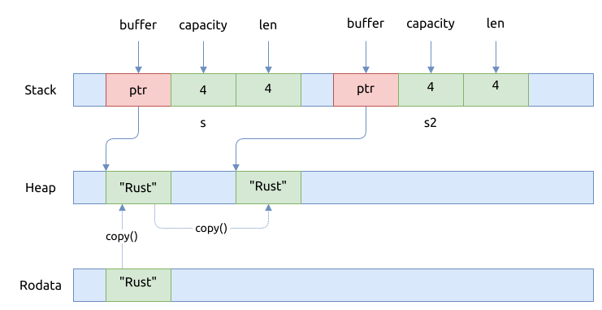
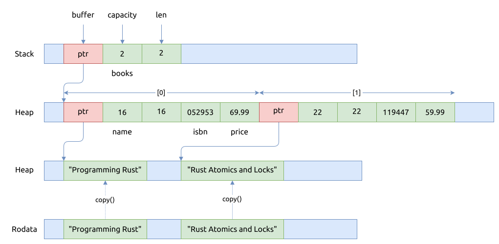
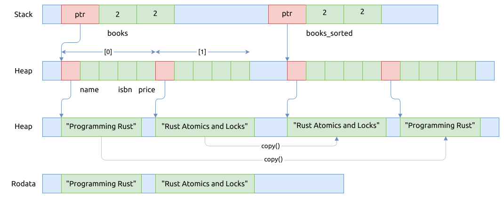

# 不需要转移所有权

基础数据类型的值可以直接被拷贝, 因为它们的结构通常都很简单, 拷贝的效率很高.

而且有时候需要深拷贝一个值, 这样的话新的值与原先的值可以共存, 而且双方没有任何关联.

上面的情竞, 都不需要再转移值的所有权.

## Copy trait

当一个类型实现了 `Copy` trait 后, 该类型的变量在赋值时, 进行的是复制的操作, 而不是转移（move）操作.

```rust
{{#include assets/copy-primitives.rs:5:}}
```

上面的代码很好地演示了基础类型字面量的拷贝, 在标准库中都为它们实现了 `Copy` trait.
这里的拷贝是将它们

这里类型包括:

- [整数类型](../primitives/integer.md)
- [浮点类型](../primitives/floating-point.md)
- [bool](../primitives/bool.md)
- [元组 tuple](../primitives/tuple.md), 要求元组中的元素也都是基础数据类型
- [数组 array](../primitives/array.md), 要求数组中的元素也都是基础数据类型
- [字符 char](../primitives/char.md)
- [切片 slice](../primitives/slice.md)
- [字符串字面量 string literal](../primitives/string-literals.md)

下面来解释一下数组的拷贝过程, 首先看看上面代码对应的汇编代码:

```rust
{{#include assets/copy-primitives.s:1316:1350}}
```

整个过程如下图所示:


## 如何"深拷贝" 字符串 - Clone trait

前文演示了 C++ 中如何深拷贝一个字符串对象, 在 Rust 中实现同样的操作也很容易.

```rust
{{#include assets/clone-string.rs:5:}}
```

生成的汇编代码如下:

```asm
{{#include assets/clone-string.s:1902:1906}}

{{#include assets/clone-string.s:1594:1652}}
```

以上操作完成之后, 内存的结构如下图所示:



上图中的 `copy()` 函数, 实际上是调用的 `slice::to_vec()` 函数实现的, 最终会调用
[`copy_nonoverlapping`][copy_nonoverlapping], 它等价于 libc 中的 `memcpy()`,
它的核心代码如下所示:

```rust, no_run
{{#include assets/slice.rs:31:35}}

{{#include assets/slice.rs:75:88}}
```

## 一个更复杂的深拷贝示例

```rust
{{#include assets/clone-book.rs:5:}}
```

先创建 `books` 数组, 里面包含了两本书:



然后再创建 `books` 数组的副本, 并且基于价格对书进行排序, 最后其内存结构如下图所示:



[copy_nonoverlapping]: https://doc.rust-lang.org/stable/std/intrinsics/fn.copy_nonoverlapping.html