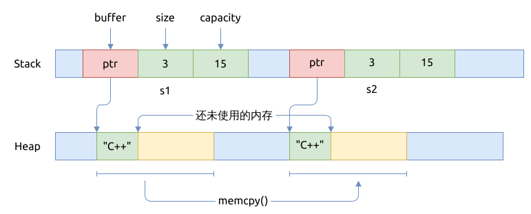
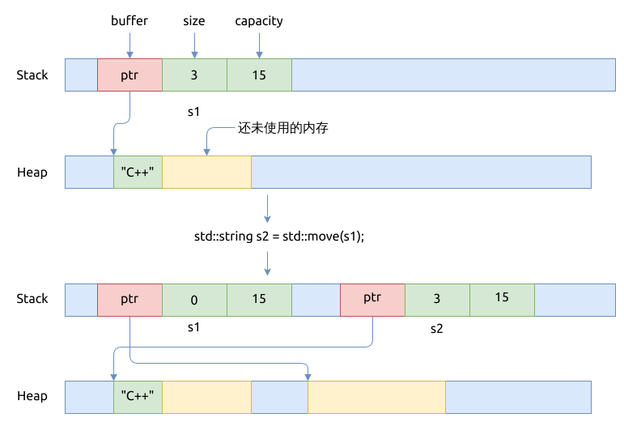

# C++ 中的移动语义 Move Semantics

有时候拷贝对象的成本太高, 会显著影响 C++ 代码的性能.

## C++11 之前的世界

之前的 C++ 版本中, 鼓励以复制的方式来构造对象, 比如:

```cpp
std::string s1 = "C++";
std::string s2 = s1;
```

上面的代码中, 字符串 `s2` 会复制一份与 `s1` 相同的堆内存, 这之后它们两个不再有任何关联.
就像下图展示的那样:



下面是一个更复杂的例子:

```cpp
{{#include assets/copy-person.cpp:5:}}
```

为了简化图例, 本文忽略了 `std::string` 相关的 SSO (short string optimization), 但这对本文的核心没有影响.
更多关于 SSO 的信息可以参考本文结尾的链接.

## C++11 引入 移动语义 Move semantics

移动语义依赖三个基础:

- move constructor
- move assignment operator
- `std::move()`

这是对 C++ 过渡封装的补救.

- 一个右值引用参数
- 转移所有权
- 原有的对象仍然保持有效状态
- 它是浅拷贝

## C++ 中的右值引用 Rvalue Reference

`std::move()` 将左值 (lvalue) 对象转换成对应的右值引用(rvalue reference).

什么是左值 lvalue?

- 可以出现在赋值表达式的左侧
- 有名字
- 有内存地址

什么是右值 rvalue?

- 除了不是 lvalue 的, 都是 rvalue
- 临时对象
- 字面量常量 literal constants, 比如 `"Hello, C++"`
- 函数返回值 (不是左值引用 lvalue reference)

```cpp
std::string s1 = "C++";
std::string s2 = std::move(s1);
```

上面的代码片段中, 字符串 `s2` 是 `s1` 原有内存的浅拷贝; 而 `s1` 里面的堆内存被重新设置了,
并且其字符串长度 `size == 0`.



下面是一个更复杂的例子, `Person` 类额外实现了

- move constructor
- move assignment operator

在创建对象时可以使用它们进行浅拷贝, 以提高程序的速度.

```cpp
{{#include assets/move-person.cpp:5:}}
```

## 参考

- [C++ Move Semantics - The Complete Guide](https://cppmove.com/)
- [C++ Core Guidelines](https://isocpp.github.io/CppCoreGuidelines/CppCoreGuidelines)
- [SSO-23](https://github.com/elliotgoodrich/SSO-23)
- [Understanding Small String Optimization (SSO) in std::string](https://cppdepend.com/blog/understanding-small-string-optimization-sso-in-stdstring/)