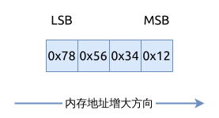
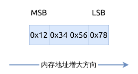

# 整数类型 Integers

Rust 支持的整数类型比较全面, 下面的表格对比了rust/python/c++的整数类型的差异:

| 有符号整数 | 无符号整数 | C++ 同类型 (有符号) | C++ 同类型 (无符号)     | 占用的字节数    |
|-------|-------|---------------|-------------------|-----------|
| i8    | u8    | int8_t        | uint8_t           | 1         |
| i16   | u16   | int16_t       | uint16_t          | 2         |
| i32   | u32   | int32_t       | uint32_t          | 4         |
| i64   | u64   | int64_t       | uint64_t          | 8         |
| i128  | u128  | __int128      | unsigned __int128 | 16        |
| isize | usize | ptrdiff_t     | size_t            | word, 4或8 |

这里的 word, 在64bit的系统里, 占用8字节; 32bit的系统里, 占用4字节.
可以看到, 除了 usize/isize 之外, 其它的整数类型都是有固定位宽/字节数的.

`u8` 可用于表示二进制字节数据; 而在 C++ 里, 通常使用 `char`, 或者 `unsigned char`, 比如下面的片段:

```c
const size_t kBufLen = 4096;
char buf[kBufLen];
```

数值可以有一些修饰, 比如:

- `0x` 前缀表示十六进制整数, `0xdeadbeef`
- `0o` 前缀表示八进制整数, `0o4096`
- `0b` 前缀表示二进制整数, `0b0110`
- 可以有后缀, 用于指定数据类型, `42u32`
- 将整数值赋给一个变量时, 可以同时用整数类型作为后缀, `let x = 42u64;`
- 对于数值的操作符, 比如 `<<`, `&` 等, 跟在 C++ 中一致
- 可以用下划线分隔, 更易读, `123_456_000_i64`

Rust 几乎不会进行隐式类型转换, 比如, i32 转为 i64, 都需要显式地写明:

```rust, no_run
let x = 42i32;
assert_eq!(x as i64, 42i64);
```

## 整数类型的内存布局 - 大小端

什么是大小端?

- 大端 big endian: 把数据的高字节位(MSB, most significant byte)保存在内存的低地址中; 而把低字节位(LSB, least significant
  byte)保存在内存的高低地址中
- 小端 little endian: 把数据的高字节位保存在内存的高低地址中; 而把低字节位保存在内存的低地址中

我们以 `let count: i32 = 0x12345678;` 为例来说明它的内存结构.

```rust
{{#include assets/endian-of-i32.rs:5: }}
```

在常用的小端的系统里, 它的布局是这样的:



我们可以通过调试器来检查:


在不常见的大端系统里, 它是这样的:



## 数值运算时溢出 overflow/underflow/wrapping

先看一段C代码:

```c
uint8_t x = 20;
uint8_t y = x * x;
```

这里的变量 `y`会得到什么值? 可以看到相乘时, `x * x == 400;`, 发生了
[整数溢出](https://en.wikipedia.org/wiki/Integer_overflow), 即`uint8_t` 能表示的最大
值是 `256`, 而相乘会得到 `400`, 超出了数值范围. 此时的处理方式是 <b>wrap around</b>:

- 将计算结果对 2^N 取模, 只保留最低有效位
- `400 % 2.pow(8) == 144;`, 所以这里的 `y == 144;`

但是, C语言中的以上处理方式, 只针对无符号数值才是有效的; 如果是有符号数值出现了溢出, 那计算结果
是未知的, 这是一个未定义行为 (undefined behavior, UB).

但是针对这个问题, Rust语言提供了更加安全的处理方法. 使用同样的代码片段:

```rust, no_run
let x: u8 = 20;
#[allow(arithmetic_overflow)]
let y: u8 = x * x;
assert_eq!(y, 144u8);
```

Rust playground 默认是以 `debug` 编译模式运行的, 以上代码运行时会异常退出 (panic), 这种行为
是已知的确定的. 另外, `#[allow(arithmetic_overflow)]` 这行代码用于禁用rustc编译器的溢出检查,
这样才能编译这部分代码.

但是, 保存这部分代码到本地文件并命名为`overflow.rs`, 我们用 `release` 模式编译它:

```bash
rustc -O overflow.rs
```

生成的二进制文件 `./overflow` 是可以正常运行的, 而且 `y == 144;`, 这个结果跟C语言一致.

除了以上的默认行为之外, Rust还提供了四组方法, 用于应对整数运算的溢出, 它们有不同的前缀:

- `checked_xxx()`, 返回值是 `Option<T>`, 当溢出发生时, 返回None, 比如:
    - `assert_eq!((u8::MAX - 2).checked_add(3), None)`
- `overflowing_xxx()`, 返回值是 `(T, bool)`, 当发生溢出时, 返回`(wrapped-value, true)`, 比如:
    - `assert_eq!(u8::MAX.overflowing_add(1), (0, true))`
- `saturating_xxx()`, 返回`T`, 当溢出发生时, 返回该数值类型的边界值 (saturating value),
  `u8::MAX`, `i8::MIN`, 比如:
    - `assert_eq!(u8::MAX.overflowing_add(1), (0, true))`
- `wrapping_xxx()`, 返回`T`, 当溢出发生时, 返回溢出后的值(通过取模), 比如:
    - `assert_eq!(25u8.wrapping_mul(12), 44)`

这里的`xxx()`后缀代表了不同的数值运算操作:

| 后缀    | 功能  | 示例代码                                                   |
|-------|-----|--------------------------------------------------------|
| `add` | 加   | `assert_eq!(100_u8.checked_add(2), Some(102))`         |
| `sub` | 减   | `assert_eq!(2_u8.checked_sub(5), None)`                |
| `mul` | 乘   | `assert_eq!(100_u8.saturating_mul(4), 255)`            |
| `div` | 除   | `assert-eq!((-128i8).wrapping_div(-1), -128)`          |
| `rem` | 求余  | `assert_eq!(5u8.checked_rem(2), Some(1))`              |
| `neg` | 否定  | `assert_eq!(2i8.overflowing_neg(), (-2, false))`       |
| `abs` | 绝对值 | `assert_eq!((-10i8).overflowing_abs(), (10, false))`   |
| `pow` | 指数  | `assert_eq!(3u8.overflowing_pow(5), (243, false))`     |
| `shl` | 左移  | `assert_eq!(0x1u8.overflowing_shl(132), (0x10, true))` |
| `shr` | 右移  | `assert_eq!(0x10u8.checked_shr(129), None)`            |

## 常用的函数

- `abs()`, 返回绝对值
- `count_ones()`, 计算比特值是1的数量
- `count_zeros()`, 计算比特值是0的数量
- `max()`, 返回两个值的最大值
- `min()`, 返回两个值的最小值
- `pow()`, 进行指数运算
- `reverse_bits()`, 反转比特位
- `to_le()`, 按小端(little-endian)顺序来解读该数值

## 一些常量值

- `MAX`, 该整数类型能表示的最大值, 比如 `assert_eq!(u8::MAX, 255)`
- `MIN`, 该整数类型能表示的最小值, 比如 `assert_eq!(i8::MIN, -128)`
- `BITS`, 该整数类型的比特数, 比如 `assert_eq!(i32::BITS, 32)`

## 参考

- [Integer overflow](https://en.wikipedia.org/wiki/Integer_overflow)