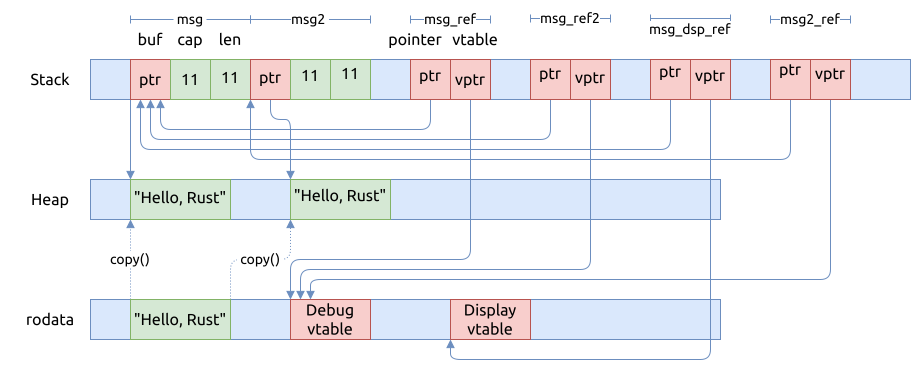

# ptr::eq() 与 ptr::addr_eq() 函数

它们都用于比较原始指针 (*const T) 是否相等.

```rust, ignore
pub fn eq<T>(a: *const T, b: *const T) -> bool
    where
        T: ?Sized;
        
pub fn addr_eq<T, U>(p: *const T, q: *const U) -> bool
where
    T: ?Sized,
    U: ?Sized;
```

可以看到, 它们的定义是差不多的. 区别在于:

- `eq()` 除了比较胖指针的指针地址外, 还会比较胖指针里的 metadata, 例如 (length, vtable 等等)
- `addr_eq()` 只比较胖指针的指针地址, 只要地址相同, 就返回 true

看下面的例子:

```rust
{{#include assets/eq.rs:5:}}
```

上面的代码中的变量, 其内存布局大致如下图所示, 要注意里面的 trait object 的指针:

