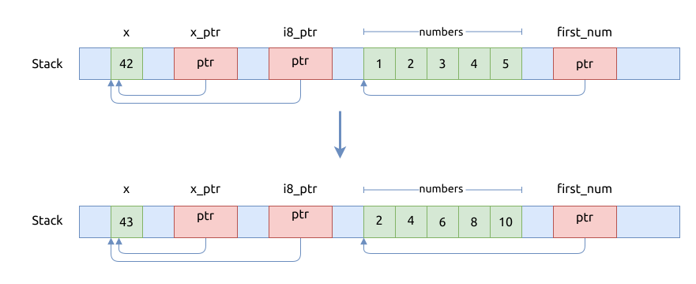

# 原始指针 raw pointer

Rust 支持原始指针, 原始指针与 C 语言中的指针是完全一样的.

## 只读指针 const pointer

不能通过只读指针, 来修改指针指向的内存的值.

只读指针的形式是 `*const T`, 相当于 C 语言中的 `const T*`.

`*const c_void` 对应于 C 语言中的 `const void*`, 可以代表指向任意类型的指针, 使用时需要显式地转型.

具体来说, 只读的原始指针分为三种:

- `*const T`, 指向元素 `T` 的原始指针
- `*const [T]`, 指向切片的原始指针
- `*const [T; N]`, 指向数组的原始指针, 这里包含了数组中的元素类型 `T` 以及元数的个数 `N`

### `*const T`

这个原始指针的用处要更广泛一些, 它可以与 C 语言中的 `const T*` 进行互操作, 是 ABI 兼容的.

先看一个示例程序:

```rust
{{#include assets/const-ptr.rs:5:}}
```

上面代码, 对应的内存操作如下图所示:


下面还列出了指针的常用运算.

- `is_null()`, 判断指针是否为空
- `cast()`, 转换为指向另一种数据类型的指针
- `cast_mut()`, 将不可变更指针转换为可变更指针
- `addr()`, 得到指针的地址, 相当于 `x_ptr as usize`

指针偏移运算:

- `offset()`
- `byte_offset()`
- `wrapping_offset()`
- `wrapping_byte_offset()`
- `add()`
- `byte_add()`
- `wrapping_add()`
- `wrapping_byte_add()`
- `sub()`
- `byte_sub()`
- `wrapping_sub()`
- `wrapping_byte_sub()`

两指针之间的关系:

- `offset_from()`
- `byte_offset_from()`
- `sub_ptr()`

### `*const [T]` 与 `*const [T; N]`

针对这两个指针的操作方式比较受限.

先看一个用例程序:

```rust
{{#include assets/const-ptr-array.rs:5:}}
```

`*const [T]` 本身是一个切片引用, 它的内存布局与 `&[T]` 是一致的, 甚至可以进行互换.

```rust, no_run
{{#include assets/const-ptr-array.rs:28:31}}
```

`*const [T; N]` 占用的内存中, 只有一个指向原始数组的指针, 并不包含数组的元素个数, 元素个数是编译器处理的.

其内存操作如下图所示:


## 可变更指针 mutable pointer

可变更指针的形式是 `*mut T`, 相当于 C 语言中的 `T*`.

而 `*mut c_void` 相当于 C 语言中的 `void*`, 可以代表指向任意类型的指针, 在使用时需要显式地转型.

所谓的可变更指针, 是可以通过该指针来修改指针所指向的内存的值.

与不可变更指针类型, 可变更指针也有三种形式:

- `*mut T`, 指向元素 `T` 的原始指针
- `*mut [T]`, 指向切片的原始指针
- `*mut [T; N]`, 指向数组的原始指针, 这里包含了数组中的元素类型 `T` 以及元数的个数 `N`

### `*mut T`

先看一个示例程序:

```rust
{{#include assets/mut-ptr.rs:5:}}
```

上面代码, 对应的内存操作如下图所示:



这里的, `i8_ptr` 比较有意思, 它只是指向了 `x` 的第一个字节, 如果是小端 (little endian) 的系统,
里面存放的数值恰好是 `43`.

下面还列出了可变更指针的常用运算.

- `is_null()`, 判断指针是否为空
- `cast()`, 转换为指向另一种数据类型的指针
- `cast_const()`, 将可变更指针转为 `*const T`
- `addr()`, 得到指针的地址, 相当于 `x_ptr as usize`

指针偏移运算:

- `offset()`
- `byte_offset()`
- `wrapping_offset()`
- `wrapping_byte_offset()`
- `add()`
- `byte_add()`
- `wrapping_add()`
- `wrapping_byte_add()`
- `sub()`
- `byte_sub()`
- `wrapping_sub()`
- `wrapping_byte_sub()`

两指针之间的关系:

- `offset_from()`
- `byte_offset_from()`
- `sub_ptr()`

### `*mut [T]` 与 `*mut [T; N]`

## 模拟 C++ 中的 const_cast::<T>

前文有介绍过, Rust 中声明的变量默认都是只读的, 除非显式地声明为 `mut`, 比如 `let mut x = 42;`.
但有时候, 可能需要实现像 C++ 中的 `const_cast()` 那样的类型转换工作, 以方便在函数内部修改一个不可变变量的值.

以下代码片段演示了如何通过原始指针进行类型转换的操作:

```rust
{{#include assets/const-cast.rs:5:}}
```

上面的示例中, 通过取得只读变量 `x` 的内存地址, 直接将新的值写入到该地址, 就可以强制修改它的值.